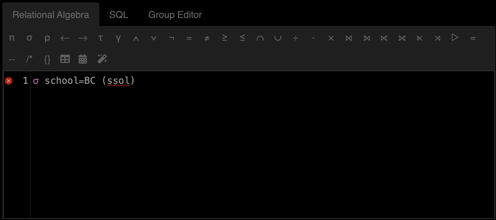
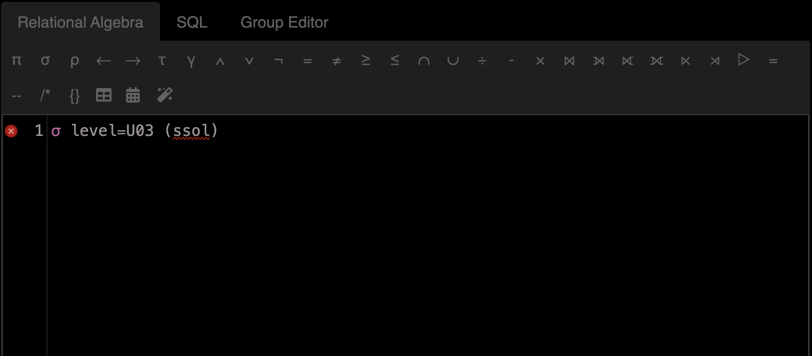

## Concepts
1. **Data Integrity**: Database systems ensure data integrity through constraints and transactions, reducing the risk of data corruption.
**Data Security**: Databases provide robust security mechanisms to control access and protect sensitive information.
**Data Redundancy and Consistency**: Databases minimize data redundancy and ensure consistency through normalization and relational integrity.
**Efficient Data Access**: Databases use indexing and query optimization to provide efficient data retrieval.
**Concurrent Access**: Databases support concurrent access, allowing multiple users to read and write data simultaneously without conflicts.
**Backup and Recovery**: Databases offer built-in mechanisms for data backup and recovery, ensuring data can be restored in case of failure.
**Scalability**: Databases are designed to handle large volumes of data and can scale horizontally or vertically as needed.
**Data Abstraction**: Databases provide a higher level of data abstraction, allowing users to interact with data without needing to understand the underlying file structures.
2. 
  - a. 
    - **Physical Level**: Describes how data is actually stored inthe database, including data structures and file organization.
    - **Logical Level**: Describes what data is stored in thedatabase and the relationships among those data. This level isconcerned with the structure of the entire database.
    - **View Level**: Describes only part of the entire database. This level provides a way for users to interact with the data without needing to know the underlying complexities.
  
  - b. 
    - **Complexity Exposure**: File-based systems expose the complexities of data storage, such as file formats, data parsing, and data integrity management, to the application developer.
    - **Lack of Standardization**: There is no standardized way to access and manipulate data in files, leading to custom implementations for each application.
    - **Manual Data Management**: Developers must manually handle data consistency, concurrency, and recovery, which are automatically managed by database systems.
    - **No Unified Interface**: File-based systems do not provide a unified interface for querying and updating data, requiring developers to write custom code for each operation.
    - **Limited Data Integrity**: Ensuring data integrity and enforcing constraints is more challenging and error-prone in file-based systems compared to database systems.
3. - **Physical Level**:
      - ***Description***: This is the lowest level of abstraction and describes how data is actually stored in the database. It includes details about data structures, file organization, indexing, and storage allocation.
       - ***Purpose***: To manage the physical storage of data and optimize performance.
   
    - **Logical Level**:
      - ***Description***: This level describes what data is stored in the database and the relationships among those data. It focuses on the logical structure of the entire database, including tables, columns, data types, and relationships.
      - ***Purpose***: To provide a logical view of the data, independent of how it is physically stored. This level is used by database administrators and developers to define and manage the database schema.

    - **View Level**:
      - ***Description***: This is the highest level of abstraction and describes only a part of the entire database. It provides different views of the database to different users based on their needs and access rights.
      - ***Purpose***: To simplify interaction with the database by providing a tailored view of the data, hiding the complexity of the underlying logical and physical structures. This level is used by end-users and application programs to interact with the data.
4. - **Database Schema**:
       - ***Definition***: The database schema is the overall design or blueprint of the database. It defines the structure of the database, including tables, columns, data types, relationships, constraints, and indexes.
       - ***Characteristics***:
         - **Static**: The schema is typically defined once and changes infrequently.
         - **Descriptive**: It describes the logical structure of the data.
         - **Example**: A schema might define a table Employees with columns EmployeeID, Name, Position, and Salary.

    - **Database Instance**:
      - ***Definition***: A database instance is the actual content of the database at a particular point in time. It is the collection of data stored in the database as per the schema.
      - ***Characteristics***:
        - **Dynamic**: The instance changes frequently as data is inserted, updated, or deleted.
        - **Actual Data**: It represents the current state of the data in the database.
        - **Example**: An instance might include rows in the Employees table with specific values for EmployeeID, Name, Position, and Salary.

    - **Corresponding Concepts in Object-Oriented Language**
      - **Class (Corresponds to Schema)**:
        - ***Definition***: In object-oriented programming, a class is a blueprint or template for creating objects. It defines the properties (attributes) and behaviors (methods) that the objects created from the class will have.
        - ***Example***: A class Employee might define attributes like employeeID, name, position, and salary, and methods like `getDetails()` and `updateSalary()`.

      - **Object (Corresponds to Instance)**:
        - ***Definition***: An object is an instance of a class. It is a specific realization of the class with actual values for the attributes defined by the class.
        - ***Example***: An object employee1 might be an instance of the Employee class with specific values like `employeeID = 101`, `name = "John Doe"`, `position = "Manager"`, and `salary = 75000`.

    - **Summary**
      - Database Schema is like a Class: Both define the structure and blueprint.
      - Database Instance is like an Object: Both represent specific realizations with actual data.
5. - **Data definition Language**
       - ***Definition***: Data Definition Language (DDL) is a subset of SQL used to define and manage database structures such as tables, indexes, and schemas.
       - ***Purpose***: To create, modify, and delete database objects.
       - ***Common Commands***:
      `CREATE`: To create new database objects (e.g., tables, indexes).
      `ALTER`: To modify existing database objects.
      `DROP`: To delete database objects.
      `TRUNCATE`: To remove all records from a table, but not the table itself.
    - **Data Manipulation Language**
      - ***Definition***: Requires the user to specify what data is needed and how to get it.
      - ***Purpose***: To manipulate the data stored in the database.
    - **Two Types of Data Manipulation Language**
      - **Procedural DML**:
        - ***Definition***: Requires the user to specify what data is needed and how to get it.
        - ***Example***: PL/SQL (Procedural Language/SQL) in Oracle, T-SQL (Transact-SQL) in Microsoft SQL Server.
        - ***Characteristics***: Involves writing detailed procedures or scripts to manipulate data.
      - **Non-Procedural DML**:
        - ***Definition***: Requires the user to specify what data is needed without specifying how to get it.
        - ***Example***: Standard SQL (Structured Query Language).
        - ***Characteristics***: Focuses on what data to retrieve or manipulate, leaving the details of how to the database management system.
6. - **Two-Tier Database Application Architecture**
     - ***Definition***: In a two-tier architecture, the application is divided into two layers: the client and the server.
     - ***Components***:
       - **Client**: The user interface and application logic reside on the client side. The client directly communicates with the database server.
       - **Server**: The database server manages the database and handles data storage, retrieval, and management.
     - ***Communication***: The client sends requests directly to the database server, and the server responds with the requested data.
   - **Three-Tier Database Application Architecture**
     - ***Definition***: In a three-tier architecture, the application is divided into three layers: the presentation layer, the application layer, and the data layer.
     - ***Components***:
       - **Presentation Layer**: The user interface, typically a web browser or mobile app.
       - **Application Layer**: The business logic and application processing, often implemented as a web server or application server.
       - **Data Layer**: The database server that manages data storage, retrieval, and management.
     - ***Communication***: The client interacts with the application server, which in turn communicates with the database server. This separation allows for better scalability, maintainability, and security.
   - **Full-Stack Web Application**
    A full-stack web application is typically a three-tier architecture. It includes:
     - **Presentation Layer**: The front-end (HTML, CSS, JavaScript) running in the user's browser.
     - **Application Layer**: The back-end (server-side logic) running on a web server (e.g., Node.js, Django, Ruby on Rails).
     - **Data Layer**: The database server (e.g., MySQL, PostgreSQL, MongoDB) that stores and manages the data.
7. - **Four Types of Database Users Based on Skill Level and Usage**
      - **Database Administrations:**
        - **Skill Level**: High
        - **Usage**: Responsible for managing the overall database environment. This includes defining the database schema, setting up user access controls, ensuring data integrity, performance tuning, and handling backup and recovery.
        - **Key Responsibilities**:
          - Define schema
          - Define what information users can access
          - Manage security and permissions
          - Monitor and optimize database performance
      - **Database Designers**:
        - **Skill Level**: High
        - **Usage**: Focus on designing the database structure. They work on creating the logical and physical design of the database, including tables, relationships, and constraints.
        - **Key Responsibilities**:
          - Design database schema
          - Define data models and relationships
          - Ensure normalization and data integrity
      - **Application Programmers/Developers**:
        - **Skill Level**: Medium to High
        - **Usage**: Develop applications that interact with the database. They write code to perform CRUD (Create, Read, Update, Delete) operations and implement business logic.
        - **Key Responsibilities**:
          - Write and optimize SQL queries
          - Develop application logic
          - Ensure data is correctly processed and stored
      - **End Users**:
        - **Skill Level**: Low to Medium
        - **Usage**: Use the database through applications to perform specific tasks. They interact with the database indirectly via user interfaces provided by applications.
        - **Key Responsibilities**:
          - Enter and retrieve data
          - Generate reports
          - Use application features to perform tasks
    - **User Responsible for Defining Schema and Access Information**
      ***Database Administrators*** are the type of users who define the schema and determine what information users can access. They have the highest level of control and responsibility over the database environment, ensuring that the database structure is well-defined and that appropriate access controls are in place to protect the data.

## Relational Model
### Understanding Data
1. N/A
2. Student UNI, Student PID and email
3. Student UNI, Studeng PID
4. Student UNI

### An Algebra



### Schema
```sql
CREATE TABLE instructor (
    UNI VARCHAR(50) PRIMARY KEY,
    last_name VARCHAR(50) NOT NULL,
    first_name VARCHAR(50) NOT NULL
);
```

## Entity Relationship Modeling
### Reverse Engineering


### Pros and cons
Simplicity:

Description: ER models provide a clear and straightforward way to visualize the structure of a database.
Benefit: Easy to understand and communicate with both technical and non-technical stakeholders.
Conceptual Clarity:

Description: ER models use entities, relationships, and attributes to represent data, which closely mirrors real-world scenarios.
Benefit: Helps in accurately capturing the requirements and constraints of the system.
Design Foundation:

Description: ER models serve as a blueprint for database design.
Benefit: Provides a solid foundation for creating relational databases and ensures consistency and integrity.