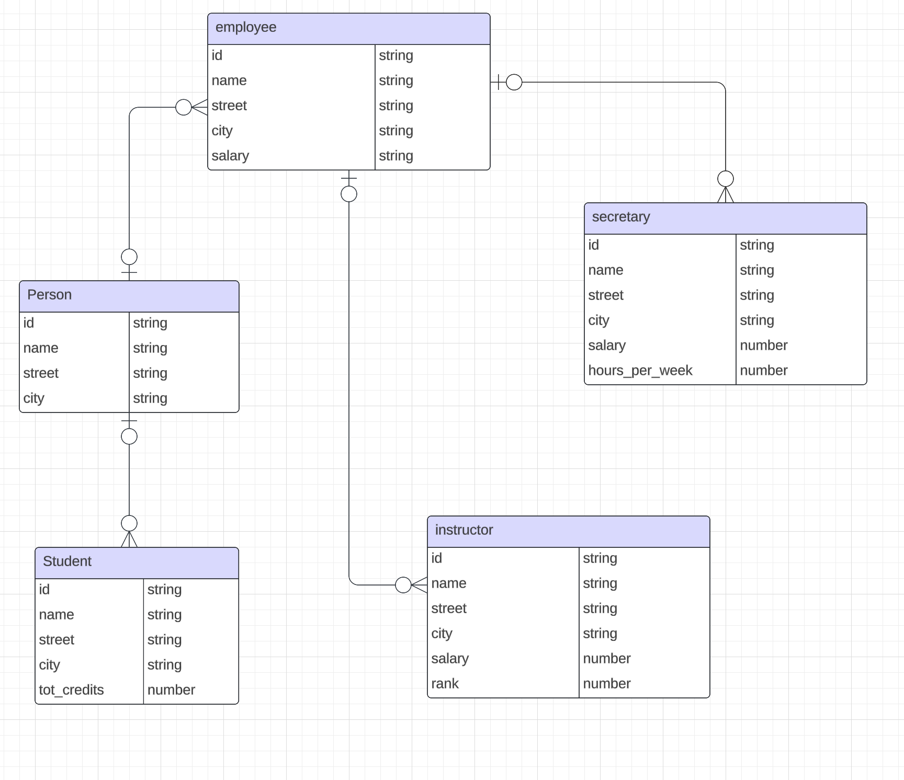

### 1. 
#### Top-Down Data Modeling
- **Definition**: Starts with a high-level overview of the system and breaks it down into more detailed components.
- **Approach**: Begins with identifying the main entities and their relationships, then progressively refines these into more detailed structures.
- **Advantages**: Provides a clear overall structure and ensures alignment with business goals.
- **Disadvantages**: Can be time-consuming and may overlook lower-level details initially.
#### Bottom-Up Data Modeling
- **Definition**: Starts with detailed data elements and builds up to a comprehensive model.
- **Approach**: Begins with identifying specific data attributes and entities, then integrates these into a larger structure.
- **Advantages**: Ensures detailed data accuracy and can be quicker to implement for smaller systems.
- **Disadvantages**: May result in a fragmented model that lacks a cohesive overall structure initially.

---

### 2.
#### Many-to-Many Relationships:
**Explanation**: In a relational database, many-to-many relationships between entities cannot be directly implemented using foreign keys alone. An associative entity (also known as a junction table or bridge table) is used to break down the many-to-many relationship into two one-to-many relationships.
**Example**: Consider a relationship between Students and Courses where a student can enroll in multiple courses, and a course can have multiple students. An associative entity Enrollments would be used to link Students and Courses.

#### Storing Additional Attributes:
**Explanation**: Sometimes, the relationship itself has attributes that need to be stored. An associative entity allows for the inclusion of these attributes.
**Example**: In the Enrollments table mentioned above, additional attributes such as EnrollmentDate, Grade, or Status can be stored, which are specific to the relationship between Students and Courses.

#### Summary
**Many-to-Many Relationships**: Associative entities are necessary to properly implement many-to-many relationships in a relational database.
**Storing Additional Attributes**: Associative entities allow for the storage of attributes that pertain to the relationship itself, providing more detailed and useful data.

---

### 3. 
#### Degree of a Relationship/Relationship Set
- Concept:
    - **Definition**: The degree of a relationship (or relationship set) refers to the number of entity types that participate in the relationship.
    - **Types**: 
      - **Unary (Degree 1)**: Involves a single entity type. Example: An employee supervises another employee.
      - **Binary (Degree 2)**: Involves two entity types. Example: A student enrolls in a course.
      - **Ternary (Degree 3)**: Involves three entity types. Example: A supplier supplies a product to a project.
#### Cardinality of a Relationship
- Concept:
    - **Definition**: The cardinality of a relationship specifies the number of instances of one entity that can or must be associated with each instance of another entity.
    - **Types**: 
      - **One-to-One (1:1)**: Each instance of entity A is associated with at most one instance of entity B, and vice versa. Example: Each person has one passport.
      - **One-to-Many (1:N)**: Each instance of entity A can be associated with multiple instances of entity B, but each instance of entity B is associated with at most one instance of entity A. Example: A teacher teaches multiple students, but each student has one teacher.
      - **Many-to-Many (M:N)**: Each instance of entity A can be associated with multiple instances of entity B, and vice versa. Example: Students enroll in multiple courses, and each course has multiple students.
#### Summary
**Degree of a Relationship**: Refers to the number of entity types involved in the relationship (Unary, Binary, Ternary).
**Cardinality of a Relationship**: Specifies the number of instances of one entity that can or must be associated with each instance of another entity (One-to-One, One-to-Many, Many-to-Many).

---

### 4. 
#### Equivalent Relational Algebra Expression

The theta-join `r ⋈θ s` can be expressed as:

```
σθ (r × s)
```

---

### 5. 
For an attribute or column where the values range from 0.00 to 99.99 and only allow two digits after the decimal point, the appropriate SQL data type would be:

```sql
DECIMAL(4, 2)
```

#### Explanation:
- `DECIMAL(4, 2)` specifies a fixed-point number with **4 total digits**, where **2 digits** are allowed after the decimal point.
- This format allows values to range from `-99.99` to `99.99`, including two decimal places.
- Since your range is positive and within `0.00` to `99.99`, this data type fits perfectly.

If we want to ensure only non-negative values (i.e., no negative values allowed), we can add a constraint such as `CHECK` in SQL:

```sql
column_name DECIMAL(4, 2) CHECK (column_name >= 0.00)
```

This ensures that the values stay within the specified range.

---

### 6. 
To determine which columns could be the primary key in the `course_management.students_fixed` table, i will analyze the properties of each column and consider what makes a good primary key.

A **primary key** must meet the following conditions:
1. It must **uniquely identify** each row in the table.
2. It cannot contain `NULL` values.
3. It should be a stable and unchanging value over time.

Given this, i will review each column:

#### `CU_id int not null`
- This column is marked as `NOT NULL`, meaning it will not contain `NULL` values.
- Since it's an integer, it can be a good candidate for a primary key if it's intended to be a unique identifier for each student.
  
   **Why it could be a primary key**: 
   - If `CU_id` is a unique identifier for each student (for example, a student ID number), it can serve as a primary key.

#### `uni varchar(12) null`
- This column allows `NULL` values (`null` keyword), which disqualifies it as a primary key because primary keys cannot contain `NULL` values.
  
   **Why it cannot be a primary key**: 
   - It allows `NULL` values, and it may not be unique (as multiple students could have the same university code).

#### `email text not null`
- This column is marked as `NOT NULL`, meaning it cannot contain `NULL` values.
- While email addresses could be unique for each student, the `TEXT` data type is usually not recommended for primary keys because it's inefficient for indexing due to its potentially large size.

   **Why it could be a primary key**: 
   - If the email addresses are guaranteed to be unique for each student, it could theoretically be used as a primary key.
  
   **Why it’s not recommended**: 
   - `TEXT` is not an optimal choice for primary keys due to performance considerations in indexing and searching.

#### `first_name text null`, `last_name text null`, `middle_name text null`
- These columns allow `NULL` values, so they are not suitable as primary keys.
  
   **Why they cannot be primary keys**: 
   - They allow `NULL` values and are not typically unique.

#### Conclusion:
The **best candidate for the primary key** in this table is `CU_id`, assuming that `CU_id` is intended to uniquely identify each student. It satisfies the criteria for a primary key: it is `NOT NULL`, likely unique, and efficient in terms of indexing.

#### SQL Example:
```sql
CREATE TABLE IF NOT EXISTS course_management.students_fixed (
 CU_id INT NOT NULL,
 uni VARCHAR(12) NULL,
 email TEXT NOT NULL,
 first_name TEXT NULL,
 last_name TEXT NULL,
 middle_name TEXT NULL,
 PRIMARY KEY (CU_id)
);
``` 

This sets `CU_id` as the primary key for the table.

---

### 7. 
Using a **natural join** can sometimes produce incorrect or nonsensical results due to its automatic behavior of joining tables based on columns that share the same names in both tables. This can lead to unexpected or incorrect results if the matching columns have values that are not logically related. Here's why this happens:

#### **Unintended Column Matches**
A natural join joins tables by automatically matching columns that share the same name in both tables. If two tables have columns with the same name but different meanings, the natural join will still attempt to join them, potentially resulting in a mismatch of data.

##### Example:
- Consider two tables, `students` and `courses`, both of which have a column called `name`.
- In the `students` table, `name` refers to the student's name, while in the `courses` table, `name` refers to the course name.
- If you perform a natural join on these tables, it will join based on the `name` column, even though the `name` in each table refers to completely different concepts (student names and course names). This would produce incorrect or nonsensical results.

```sql
SELECT * FROM students NATURAL JOIN courses;
```

This would attempt to match students with courses based on their names, which doesn't make sense.

#### **Accidental Data Loss (Fewer Results)**
If the columns being joined contain no common values, a natural join will return an empty result set. This might lead to confusion because you expect some rows to be joined, but the automatic matching behavior of the natural join prevents it.

##### Example:
- If two tables have a column `id`, but the `id` values represent different entities (e.g., `id` in one table is a student ID and in another, it is a course ID), the join will produce no results if no `id` values match between the two tables.

```sql
SELECT * FROM students NATURAL JOIN courses;
```

If `students.id` represents student IDs and `courses.id` represents course IDs, there will be no matching rows, and the result set will be empty, even though a join on the appropriate columns (e.g., `students.course_id = courses.course_id`) could have produced meaningful results.

#### **Column Ambiguity**
Natural joins remove duplicate columns from the result. If multiple columns match, the natural join may remove columns that are crucial for understanding the result, leading to confusion.

##### Example:
- If both tables have an `id` column, the natural join will automatically remove one of the `id` columns from the result to avoid duplicates. However, this can make it unclear which `id` is present in the result set (especially if they have different meanings).

```sql
SELECT * FROM students NATURAL JOIN enrollments;
```

Here, both tables might have an `id` column (e.g., `students.id` and `enrollments.id`), and after the natural join, only one `id` will remain, making it hard to tell whether the ID refers to the student or the enrollment.

#### **Implicit Logic**
The natural join performs implicit logic based on matching column names, which might not align with the intended join condition. In most cases, explicit control over the join condition is preferable to avoid ambiguity and unintended results.

##### Summary: Problems with Natural Joins
- **Unintended matches**: Natural joins can match columns that have the same name but unrelated meanings, leading to incorrect joins.
- **Data loss**: If matching columns do not share common values, the result set could be empty when you expect results.
- **Ambiguous results**: Natural joins automatically remove duplicate columns, which can make the result set confusing or incomplete.
- **Lack of control**: Natural joins do not allow you to specify which columns should be used for the join, potentially leading to unexpected outcomes.

#### Best Practice:
To avoid these issues, it is generally recommended to use **explicit joins** (`INNER JOIN`, `LEFT JOIN`, etc.) where you specify the join condition clearly. This gives you full control over which columns are used to join the tables, reducing the likelihood of errors or confusion.

Example of an **explicit join**:

```sql
SELECT * 
FROM students 
INNER JOIN enrollments 
ON students.student_id = enrollments.student_id;
```

---

### 8. 
If an SQL database management system (DBMS) does not support the **FULL OUTER JOIN** operation, we can simulate the same behavior using a combination of **LEFT JOIN**, **RIGHT JOIN**, and **UNION**. The idea is to combine the results of a left join (all rows from the left table) with a right join (all rows from the right table) while ensuring that rows that don't have matches in the other table are included.

#### Full Outer Join Concept

A **FULL OUTER JOIN** returns:
1. All records from the left table (even if they don't have matching records in the right table).
2. All records from the right table (even if they don't have matching records in the left table).
3. For rows that match in both tables, it returns the combined information from both.

#### Simulating FULL OUTER JOIN Using SQL

To simulate a **FULL OUTER JOIN**, we can use a combination of **LEFT JOIN** and **RIGHT JOIN**, along with **UNION** to combine the two results. Here’s the general approach:

1. Perform a **LEFT JOIN** between the two tables to get all rows from the left table and matching rows from the right table.
2. Perform a **RIGHT JOIN** between the two tables to get all rows from the right table and matching rows from the left table.
3. Combine the results using **UNION** to ensure that no duplicate rows are returned.

#### SQL Query to Simulate FULL OUTER JOIN

```sql
SELECT *
FROM table1
LEFT JOIN table2 ON table1.id = table2.id

UNION

SELECT *
FROM table1
RIGHT JOIN table2 ON table1.id = table2.id;
```

#### Handling Duplicates (Optional):
- By default, `UNION` removes duplicates. If your database contains columns where the values can be duplicated (e.g., `NULL` values or non-unique keys), you might need to use `UNION ALL` instead of `UNION` to keep all rows, even if they appear in both the **LEFT JOIN** and **RIGHT JOIN** results.

```sql
SELECT *
FROM employees
LEFT JOIN departments ON employees.department_id = departments.department_id

UNION ALL

SELECT *
FROM employees
RIGHT JOIN departments ON employees.department_id = departments.department_id;
```

#### Summary:

- **FULL OUTER JOIN** can be simulated using a combination of **LEFT JOIN** and **RIGHT JOIN** combined with **UNION** (or **UNION ALL** if you want to retain duplicates).
- This ensures that all rows from both tables are included in the result, with `NULL` values filling in where no matches exist.
- The approach works even if your SQL database does not natively support **FULL OUTER JOIN**.

---

### 9. 
#### **SELECT Statement and Duplicates**

By default, a **SELECT** statement **does not eliminate duplicates** in the result set. If the query retrieves multiple identical rows, they will all be included in the result set.

##### Example:

```sql
SELECT department_id
FROM employees;
```

If multiple employees have the same `department_id`, those IDs will be returned multiple times. The query will not remove duplicates unless explicitly instructed.

To remove duplicates in a **SELECT** query, we can use the **DISTINCT** keyword:

```sql
SELECT DISTINCT department_id
FROM employees;
```

This will ensure that only unique `department_id` values are returned, removing any duplicates.

#### **UNION Statement and Duplicates**

By default, a **UNION** operation **removes duplicates** in the result set. It combines the result sets of two or more `SELECT` queries and automatically eliminates duplicate rows.

##### Example:

```sql
SELECT department_id
FROM employees
UNION
SELECT department_id
FROM departments;
```

In this query, the result sets from both `employees` and `departments` are combined, and any duplicate `department_id` values will be removed from the final result.

#### **Difference in Behavior**

- **SELECT** (by itself) **allows duplicates** unless we explicitly use `DISTINCT`.
- **UNION** **removes duplicates** by default.

#### How to Make SELECT and UNION Behave the Same with Respect to Duplicates

##### a. To make **SELECT** behave like **UNION** (remove duplicates):
We can use the **DISTINCT** keyword in your `SELECT` query to remove duplicates, just like **UNION** does:

```sql
SELECT DISTINCT department_id
FROM employees;
```

##### To make **UNION** behave like **SELECT** (keep duplicates):
We can use **UNION ALL** instead of **UNION**. **UNION ALL** combines the result sets without removing duplicates, making it behave like a regular `SELECT` that allows duplicates.

```sql
SELECT department_id
FROM employees
UNION ALL
SELECT department_id
FROM departments;
```

#### Summary:

- **SELECT** allows duplicates unless you explicitly use `DISTINCT`.
- **UNION** removes duplicates by default.
- To make **SELECT** behave like **UNION**, use `DISTINCT` in the `SELECT` query.
- To make **UNION** behave like **SELECT**, use `UNION ALL` to keep duplicates.

By using these modifications, you can control how duplicates are handled in your queries.

---

The concept of **“arity”** in SQL refers to the **number of operands or arguments** that a function or operation in an SQL statement can take. Specifically, in the context of SQL and databases, "arity" usually relates to:

1. **Arity of Functions**: The number of parameters that a function in SQL accepts.
2. **Arity of Relations**: The number of attributes (columns) in a relation (table).

### 1. **Arity of SQL Functions**

SQL functions can take a specific number of arguments (inputs), and this number is referred to as the **arity** of the function. SQL functions can be:

- **Unary functions**: Functions that take **one argument**.
  - Example: `ABS(column_name)` (returns the absolute value of a column), `UPPER(column_name)` (converts a string to uppercase).
  
  ```sql
  SELECT ABS(-5); -- Returns 5
  ```

- **Binary functions**: Functions that take **two arguments**.
  - Example: `COALESCE(value1, value2)` (returns the first non-null value from the list).
  
  ```sql
  SELECT COALESCE(NULL, 'Hello'); -- Returns 'Hello'
  ```

- **N-ary functions**: Functions that take **multiple arguments** (more than two).
  - Example: `GREATEST(value1, value2, value3, ...)` (returns the greatest value from a list of arguments).
  
  ```sql
  SELECT GREATEST(5, 9, 12, 3); -- Returns 12
  ```

### 10. **Arity of Relations (Tables)**

In relational database terminology, the **arity** of a relation (table) is the **number of attributes (columns)** in that table. In other words, it represents how many columns a relation (or table) has. This concept is crucial in relational algebra and SQL queries because it affects how operations (such as joins or selections) are performed on tables.

#### Example:
Consider a table `employees` with the following columns:

| employee_id | first_name | last_name | department_id |
|-------------|------------|-----------|---------------|

The **arity** of this table is 4 because it has 4 columns (`employee_id`, `first_name`, `last_name`, `department_id`).

#### Summary:

- **Arity** refers to the number of arguments a function or operation takes.
  - **Unary** functions take one argument.
  - **Binary** functions take two arguments.
  - **N-ary** functions take multiple arguments.
- In terms of relations (tables), the **arity** is the number of columns in a table.

---

### 11. 
In **Entity-Relationship (ER) modeling**, **inheritance** or **specialization** is a way to represent entities that share common characteristics (attributes or relationships) with a parent entity but also have specific characteristics that set them apart. When modeling inheritance or specialization in an ER diagram, there are four key concepts to consider: **overlapping**, **disjoint**, **complete**, and **incomplete**. These concepts define how the subclasses relate to each other and to the superclass.

#### **Overlapping Specialization**
- **Definition**: In overlapping specialization, a single entity in the parent (superclass) can belong to **more than one subclass** simultaneously.
- **Example**: Consider an entity `Person` with two subclasses `Student` and `Employee`. If a person can be both a `Student` and an `Employee` at the same time, this is an example of overlapping specialization.
- **Usage**: Use overlapping specialization when an entity can have multiple roles or characteristics that span different subclasses.

##### ER Notation:
- Typically represented with an arc that connects the subclasses to the superclass, but the arc is not exclusive, indicating that multiple subclass memberships are allowed.

#### **Disjoint Specialization**
- **Definition**: In disjoint specialization, a single entity in the parent (superclass) can belong to **only one subclass** at a time. The subclasses are mutually exclusive.
- **Example**: Consider an entity `Person` with two subclasses `Student` and `Employee`. If a person can only be either a `Student` or an `Employee`, but not both, this is disjoint specialization.
- **Usage**: Use disjoint specialization when entities must belong to only one specific subclass.

##### ER Notation:
- Represented with a "d" (for disjoint) placed near the specialization arc that connects the subclasses to the superclass, indicating mutually exclusive membership.

#### **Complete Specialization**
- **Definition**: In complete specialization, **every entity** in the parent (superclass) must belong to **at least one subclass**. No entity can exist in the superclass without being part of a subclass.
- **Example**: Consider an entity `Vehicle` with two subclasses `Car` and `Truck`. If every vehicle must be either a `Car` or a `Truck` (and no general vehicle can exist outside these subclasses), this is complete specialization.
- **Usage**: Use complete specialization when every instance of the superclass must be specialized into one or more subclasses.

##### ER Notation:
- Represented with a double line connecting the superclass to the specialization arc, indicating that the specialization is complete (all entities must belong to some subclass).

#### **Incomplete Specialization**
- **Definition**: In incomplete specialization, **some entities** in the parent (superclass) may **not belong to any subclass**. These entities can exist in the superclass without being specialized.
- **Example**: Consider an entity `Person` with two subclasses `Student` and `Employee`. If some persons are neither students nor employees (they exist as general persons), this is incomplete specialization.
- **Usage**: Use incomplete specialization when it is acceptable for some entities to exist in the superclass without belonging to any subclass.

##### ER Notation:
- Represented with a single line connecting the superclass to the specialization arc, indicating that the specialization is incomplete (some entities can remain unspecialized).


#### Summary of Concepts:

1. **Overlapping Specialization**: 
   - An entity can belong to multiple subclasses at once.
   - Example: A person can be both a `Student` and an `Employee`.

2. **Disjoint Specialization**: 
   - An entity can belong to only one subclass at a time.
   - Example: A vehicle must be either a `Car` or a `Truck`, but not both.

3. **Complete Specialization**: 
   - Every entity in the superclass must belong to at least one subclass.
   - Example: Every `Vehicle` must be either a `Car` or a `Truck`.

4. **Incomplete Specialization**: 
   - Some entities may belong to the superclass without belonging to any subclass.
   - Example: Some persons are neither `Student` nor `Employee`.

#### Visual Summary (for ER diagrams):

- **Disjoint** is often represented with a "d" near the arc connecting the superclass and subclasses, indicating mutually exclusive subclass membership.
- **Overlapping** specializations do not have the "d" and allow entities to belong to multiple subclasses.
- **Complete** specialization is represented with a double line connecting the superclass to the subclasses.
- **Incomplete** specialization is represented with a single line connecting the superclass to the subclasses.

---

### 12. 


---

### 13. 
#### a. 
```sql
SELECT course.course_id
FROM course
WHERE course.course_id NOT IN (
    SELECT prereq.course_id FROM prereq
);

```
#### b. 
```sql
SELECT course.course_id
FROM course
LEFT JOIN prereq ON course.course_id = prereq.course_id
WHERE prereq.course_id IS NULL;
```
---

### 14. 
In database systems, **views** are virtual tables that are defined by a query on one or more base tables. They do not store data themselves but provide a way to present or restrict data in a more flexible manner. During the lecture, we discussed three main motivations for using views. These motivations represent the primary use cases for creating and using views in SQL:

#### **Simplifying Complex Queries**
- **Explanation**: Views can encapsulate complex SQL queries, making it easier to write and understand complex operations. Instead of repeatedly writing a long and complicated SQL statement, you can define a view that simplifies the process.
- **Use case**: If you have a complex query that joins multiple tables and performs aggregations, you can create a view that hides the complexity and simplifies future queries by referring to the view instead.
  
  **Example**:
  ```sql
  CREATE VIEW employee_summary AS
  SELECT department_id, COUNT(employee_id) AS total_employees
  FROM employees
  GROUP BY department_id;
  
  -- Simplified query using the view
  SELECT * FROM employee_summary WHERE total_employees > 10;
  ```

#### **Data Security and Access Control**
- **Explanation**: Views allow you to **restrict access** to specific rows and columns in a table, offering a way to enforce security policies. You can use views to expose only the necessary data to different users, hiding sensitive information.
- **Use case**: Suppose certain users should only see a subset of columns (e.g., excluding salary information), or only specific rows (e.g., data relevant to their department). You can create views that expose only the allowed data, ensuring that sensitive data is protected.

  **Example**:
  ```sql
  CREATE VIEW employee_public_view AS
  SELECT employee_id, first_name, last_name, department_id
  FROM employees;
  
  -- Users querying this view cannot see salary or other sensitive data
  SELECT * FROM employee_public_view;
  ```

#### **Logical Data Independence**
- **Explanation**: Views provide a level of abstraction that supports **logical data independence**. This means you can change the underlying table structure (e.g., add new columns or change table definitions) without affecting applications that rely on the view, as long as the view's definition remains valid.
- **Use case**: If you need to modify the schema of a database (e.g., splitting a table into multiple tables for normalization), you can still maintain backward compatibility for applications by keeping the view interface unchanged.

  **Example**:
  - If the underlying `employees` table is split into two tables `employees_basic` and `employees_details`, you can update the view to join the two tables, ensuring existing queries that rely on the view still function as before:
  
  ```sql
  CREATE VIEW employee_view AS
  SELECT b.employee_id, b.first_name, b.last_name, d.salary
  FROM employees_basic b
  JOIN employees_details d ON b.employee_id = d.employee_id;
  ```

#### Summary:
1. **Simplifying Complex Queries**: Views help encapsulate complex SQL queries, making them easier to write and reuse.
2. **Data Security and Access Control**: Views can restrict access to certain data, protecting sensitive information from unauthorized users.
3. **Logical Data Independence**: Views provide a way to abstract and maintain a consistent interface, even if the underlying database schema changes. 

---

### 15. 
#### What is a Materialized View?

A **materialized view** is a database object that contains the results of a query and stores that data physically in the database. Unlike a regular (non-materialized) view, which is a virtual table and always fetches its data dynamically from the underlying base tables when queried, a materialized view saves the query result at a specific point in time. The materialized view needs to be refreshed manually or automatically to reflect any changes in the underlying data.

#### Advantage of a Materialized View

**Performance Improvement**:  
- One major advantage of a materialized view is that it significantly **improves query performance**. Since the data is physically stored and precomputed, queries on materialized views are faster because they do not need to recompute the results from the base tables each time the view is accessed. This is particularly useful for complex queries or when dealing with large datasets that involve expensive operations (e.g., joins, aggregations).

#### Disadvantage of a Materialized View

**Data Staleness and Maintenance Overhead**:  
- A key disadvantage of a materialized view is the **data can become stale** since the view does not automatically reflect updates to the underlying tables in real-time. To keep the data in sync with the base tables, the materialized view must be **refreshed** periodically, which introduces maintenance overhead. Depending on the frequency of updates to the underlying tables and the size of the materialized view, this refresh operation can be resource-intensive.

#### Comparison to a Non-Materialized View

- **Materialized View**: Stores query results physically and must be refreshed to stay up-to-date.
  - **Advantage**: Faster query performance due to precomputed results.
  - **Disadvantage**: Risk of outdated data and the need for refresh operations.
  
- **Non-Materialized View**: Does not store data physically and computes results dynamically from base tables.
  - **Advantage**: Always shows the most up-to-date data from the underlying tables.
  - **Disadvantage**: Slower query performance, especially for complex queries.
